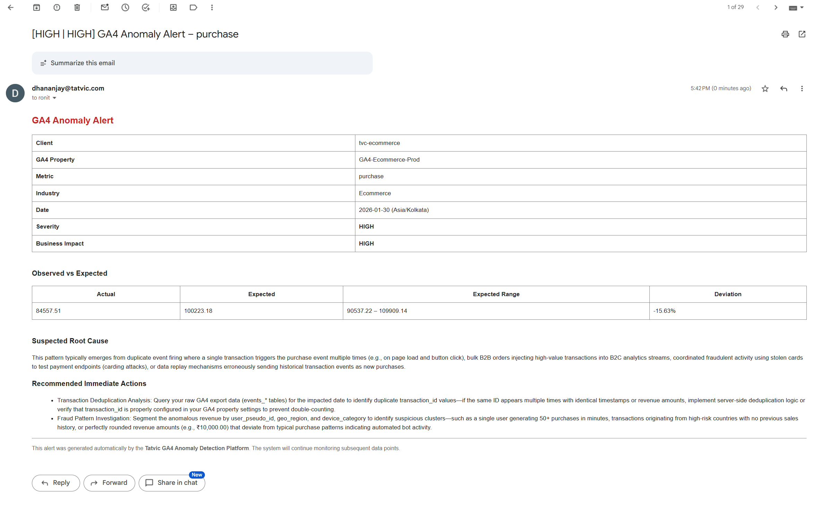

# GA4 Anomaly Detection Platform – Technical Documentation

This repository contains the complete implementation of a **production-grade, serverless GA4 anomaly detection platform** built on **Google BigQuery**, **BigQuery ML**, and **Google Apps Script**.

---

## 📁 Repository Structure

```
ga4-anomaly-detlection-solution/
│
├── README.md                        # Project overview & architecture
├── LOGIC.md                         # Severity, business impact & root cause logic
│
├── Report_Capstone_G5.pdf           # Project Report
|
├── sql/
│   ├── synthetic_data/
│   │   ├── daily_data_generator.sql
│   │   ├── anomaly_injector.sql
│   │
│   ├── aggregation/
│   │   ├── loading_to_daily_metric.sql
│   │   ├── processing_gap_filling.sql
│   │
│   ├── modeling/
│   │   ├── calculating_statistical_metric.sql
│   │   ├── ARIMA_retrain_30_days.sql
│   │
│   ├── scoring/
│   │   ├── severity_business_logic.sql
│   │   ├── alert_decision.sql
│
├── apps_script/
│   ├── email_alert_pipeline.gs
│
├── assets/
│   └── email_snapshot.png           # Example email alert
│
└── diagrams/
    └── architecture.png             # System architecture diagram
```

---

## 🚀 System Overview

A fully serverless, batch-oriented anomaly detection platform for GA4 e-commerce metrics, built entirely on Google Cloud Platform. The system:

- **Generates synthetic GA4 events** with realistic seasonality & holidays
- **Trains per-metric ARIMA_PLUS models** for forecasting
- **Detects anomalies** using prediction intervals & ML.DETECT_ANOMALIES
- **Classifies severity & business impact** with metric-specific logic
- **Decides alert eligibility** with suppression & business-hour rules
- **Sends automated email alerts** via Google Apps Script

---

## 🧱 Architecture

### 3.1 High-Level Flow

```
Synthetic GA4 Events
        ↓
Daily Metric Aggregation
        ↓
Gap Filling (Zero Imputation)
        ↓
ARIMA_PLUS Forecasting (per metric)
        ↓
Anomaly Detection (Statistical + ML)
        ↓
Severity & Business Impact Classification
        ↓
Alert Eligibility & Suppression
        ↓
Email Payload Construction
        ↓
Automated Email Delivery (Apps Script)
```

### 3.2 Key Design Principles

- **Serverless & Batch-Oriented**: Built on BigQuery Scheduled Queries
- **Deterministic & Idempotent**: Safe replays & backfills
- **Strict Separation of Concerns**: Analytics (BigQuery) vs. Delivery (Apps Script)
- **Timezone-Aware**: IST business days, UTC execution
- **Materialized Dependency Chain**: Each stage outputs a concrete table

---

## 📊 Data Layers

### 4.1 Datasets

| Dataset | Purpose |
|---------|---------|
| `GA4SampleData_live` | Raw synthetic GA4 events (immutable) |
| `analytics_live` | Derived metrics, models, anomalies, decisions (mutable) |

### 4.2 Core Tables

| Table | Description |
|-------|-------------|
| `events_YYYYMMDD` | Daily synthetic GA4 events |
| `ga4_event_metrics_daily` | Aggregated daily metrics |
| `ga4_event_metrics_daily_filled` | Gap-filled metrics (zero for missing days) |
| `ga4_anomaly_enriched_all_events` | Statistical anomalies with forecasts |
| `ga4_anomaly_scored_events` | Severity, impact, root cause, recommendations |
| `ga4_anomaly_alert_decisions` | Alert eligibility & suppression |
| `ga4_anomaly_email_payload_view` | Final email payload (view) |

---

## ⚙️ Pipeline Stages

### 5. Synthetic Data Generation
- **Purpose**: Simulates real GA4 events for development & testing
- **Features**: Seasonality, holidays, user persistence, anomaly injection
- **Files**: `sql/synthetic_data/daily_data_generator.sql`, `anomaly_injector.sql`

### 6. Daily Metric Aggregation
- **Purpose**: Transforms event-level data into daily time-series
- **Metrics**: `page_view`, `session_start`, `user_engagement`, `add_to_cart`, `add_payment_info`, `purchase`
- **Files**: `sql/aggregation/loading_to_daily_metric.sql`

### 7. Gap Filling
- **Purpose**: Ensures continuous time-series for modeling
- **Logic**: LEFT JOIN + COALESCE(..., 0)
- **Files**: `sql/aggregation/processing_gap_filling.sql`

### 8. Time-Series Modeling
- **Model**: ARIMA_PLUS (BigQuery ML)
- **Strategy**: One model per metric, retrained every 30 days
- **Files**: `sql/modeling/ARIMA_retrain_30_days.sql`

### 9. Anomaly Detection
- **Dual Signal**: Prediction interval breach + ML.DETECT_ANOMALIES
- **Thresholds**: Metric-specific (e.g., purchase: 0.99, page_view: 0.97)
- **Files**: `sql/modeling/calculating_statistical_metric.sql`

### 10. Severity & Business Logic
- **Directional Logic**: Decline-only for revenue, bidirectional for traffic
- **Severity Levels**: CRITICAL, HIGH, MEDIUM, LOW, NONE
- **Root Cause & Recommendations**: Deviation-band-specific
- **Files**: `sql/scoring/severity_business_logic.sql`, `Logic.md`

### 11. Alert Decisioning
- **Eligibility**: `is_anomaly = TRUE`, severity ∈ {HIGH, CRITICAL}, impact ∈ {HIGH, VERY_HIGH}
- **Suppression**: Outside business hours, repeated alerts
- **Priority**: P0 (CRITICAL), P1 (HIGH + HIGH impact)
- **Files**: `sql/scoring/alert_decision.sql`

### 12. Email Delivery
- **Logic-Free Apps Script**: Only fetches and sends
- **One Email Per Metric**: Clear, actionable alerts
- **Files**: `apps_script/email_alert_pipeline.gs`

---

## 🕒 Scheduling & Timezone Handling

### Execution Schedule (UTC)

| Time (UTC) | Job | Purpose |
|------------|-----|---------|
| 19:00 | Synthetic GA4 Generator | Create daily events |
| 19:10 | Anomaly Injector | Inject probabilistic anomalies |
| 20:30 | Metric Aggregation | Aggregate daily metrics |
| 20:35 | Gap Filling | Ensure metric continuity |
| 20:45 | Anomaly Detection | Forecast & classify anomalies |
| 20:50 | Severity & Business Logic | Assign categories |
| 20:55 | Alert Decision | Select high/critical alerts |
| 21:00 | Email Script | Send final alerts |

### Timezone Strategy
- **Execution Timezone**: UTC (BigQuery Scheduled Queries)
- **Business Timezone**: Asia/Kolkata (IST)
- **Processing Rule**: Always process `yesterday` (IST)

---

## 📧 Alert Email Example



**Subject**: `[HIGH | HIGH] GA4 Anomaly Alert - purchase`

**Body Includes**:
- Client & GA4 property
- Metric, date, timezone
- Actual vs expected values with deviation %
- Severity & business impact
- Suspected root cause
- Recommended immediate actions

---

## 🛡️ Production-Grade Guarantees

- ✅ **Idempotent**: Safe re-runs & backfills
- ✅ **Deterministic**: Same input → same output
- ✅ **Auditable**: All logic in SQL, no black boxes
- ✅ **Scalable**: Serverless, batch-oriented
- ✅ **Maintainable**: Clear separation of concerns
- ✅ **Extensible**: Add metrics/models without refactoring

---

## 📚 Related Documentation

- [Logic.md](Logic.md) – Detailed severity, business impact, root cause, and recommendation logic
- [diagrams/architecture.png](diagrams/architecture.png) – System architecture diagram

---

## 👥 Maintainers

- **Dhananjay** (`dhananjay@tatvic.com`)
- **Ronit** (`ronit@tatvic.com`)
- **Aarya** (`aarya@tatvic.com`)
- **Vishnu** (`vishnu@tatvic.com`)

---

## 📄 License

Proprietary – Tatvic Analytics Private Limited.
